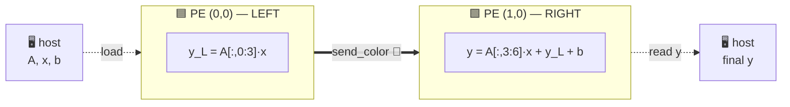

# 🎨 Cerebras SDK & CSL — Programming the Wafer


The **WSE-3** inside the Cerebras CS-3 is a nearly million-core wafer. Beyond AI, its ultra-high
bandwidth fabric suits HPC kernels — seismic imaging, CFD, Monte Carlo particle transport, molecular
dynamics (several Gordon Bell finalists). The **Cerebras SDK** lets you write your *own* wafer-scale
kernels in **CSL** (Cerebras Software Language), programming individual PEs and the routing between them.

> [!NOTE]
> **You write two pieces:** (1) **device code** in CSL that runs on the PEs, and (2) **host code** in
> Python that moves data on/off the wafer and launches functions. You'll develop and run everything on
> the **cycle-accurate fabric simulator** — no hardware needed.

---

## 🧭 What you'll do


---

## 🛠️ 1. Set up the SDK

On an ALCF Cerebras login/user node, copy the SDK and put `cslc` on your `PATH`:

```bash
cp -r /software/cerebras/cs_sdk-2.10 ~
export PATH=~/cs_sdk-2.10:$PATH
```

Verify it works:

```bash
cslc --help
```

> [!TIP]
> Add the `export PATH=...` line to your `~/.bashrc` so `cslc` and `cs_python` are always available.

If you need to reach external resources, set the proxy:

```bash
export HTTPS_PROXY=http://proxy.alcf.anl.gov:3128
export https_proxy=http://proxy.alcf.anl.gov:3128
```

## 📥 2. Get the example programs

The full tutorial set (gemv-00 … gemv-09, pipelines, collectives, and more):

```bash
git clone https://github.com/Cerebras/csl-examples.git
cd csl-examples
git checkout v2.10.0
```

Each tutorial is self-contained and runs on the simulator with a single script:

```bash
cd tutorials/gemv-01-complete-program/
bash commands_wse3.sh          # cslc compiles, cs_python drives the fabric simulator
```

> [!NOTE]
> A single-PE GEMV (`gemv-01` … `gemv-05`) uses **zero colors** — one processor, no network.
> **Colors only appear the moment work crosses a PE boundary.** That's exactly what the hands-on is about. 👇

---

## 🎨 Hands-on: GEMV on 2 PEs — wire the colors


📂 Files for this exercise are in **[`two-pe-gemv/`](./two-pe-gemv/)** (`starter/` = your task, `solution/` = answer key).

### The problem

Compute `y = A·x + b` where `A` is `4×6`. We split `A` by **columns** across two PEs: each computes
half of `A·x`, and the **left PE sends its partial result to the right PE**, which adds it in. That
single hand-off is the whole lesson. 🎯



### 🎨 Colors in 60 seconds

> [!IMPORTANT]
> A **color** is a hardware **routing channel** — a wire threaded through the PEs. To make a value
> travel, each PE gives that color a **route** with two parts:
> - **`.rx`** — where a wavelet **comes in from**
> - **`.tx`** — where it **goes out to**
>
> Directions are **`RAMP`** (in/out of *this* PE's compute core) and the compass **`EAST` / `WEST` /
> `NORTH` / `SOUTH`** (to a neighbor). **Same color, different route on each PE.**

This program declares exactly **one** color:

```csl
const send_color: color = @get_color(0);   // one channel carries y_L from LEFT → RIGHT
```

### ✅ Your task

**Everything is already written** — `pe_program.csl` (the compute), `run.py` (the host), the PE
placement — **except the color routes.** Open [`two-pe-gemv/starter/layout.csl`](./two-pe-gemv/starter/layout.csl)
and find the two `EXERCISE` blocks. Fill in the `???` for each PE's route on `send_color`, choosing
from `RAMP, EAST, WEST, NORTH, SOUTH`:

```csl
// Left PE (0,0) — sends its partial result y_L toward the EAST neighbor
@set_color_config(0, 0, send_color, .{.routes = .{ .rx = .{ ??? }, .tx = .{ ??? } }});

// Right PE (1,0) — receives from the WEST, delivers into its own compute core
@set_color_config(1, 0, send_color, .{.routes = .{ .rx = .{ ??? }, .tx = .{ ??? } }});
```

| PE | role | `.rx = .{ ? }` | `.tx = .{ ? }` |
|----|------|:---:|:---:|
| `(0,0)` LEFT  | **send** `y_L` to the east neighbor | ❓ | ❓ |
| `(1,0)` RIGHT | **receive** from the west, deliver to core | ❓ | ❓ |

> [!TIP]
> Think of it as one wire: the left PE's value **leaves its core (`RAMP`) heading `EAST`**; the right
> PE **takes it off the `WEST` link into its core (`RAMP`)**. One color, two complementary routes.

### ▶️ Compile and run on the simulator

```bash
cd two-pe-gemv/starter
bash commands_wse3.sh
```

This runs `cslc` (compile) then `cs_python run.py` (fabric simulation) and prints **`SUCCESS!`** when
your routing is correct.

### 🚦 What you'll see

| Signal | Meaning | Fix |
|---|---|---|
| ❌ won't compile | a `???` is still there | fill in all four routes |
| ⏳ hangs forever | routes don't line up (e.g. both PEs "send") | the right PE waits for data that never arrives — recheck directions |
| ✅ `SUCCESS!` | the color routes `y_L` correctly | 🎉 you wired your first fabric color |

<details>
<summary>🔑 Stuck? Reveal the answer key</summary>

| PE | `.rx` | `.tx` |
|----|:---:|:---:|
| `(0,0)` LEFT  | `RAMP` | `EAST` |
| `(1,0)` RIGHT | `WEST` | `RAMP` |

```csl
@set_color_config(0, 0, send_color, .{.routes = .{ .rx = .{RAMP}, .tx = .{EAST} }});
@set_color_config(1, 0, send_color, .{.routes = .{ .rx = .{WEST}, .tx = .{RAMP} }});
```

Full working program in [`two-pe-gemv/solution/`](./two-pe-gemv/solution/).
</details>

### 🧠 Takeaway

- **1 PE → 0 colors.** Cross a PE boundary → you need a color.
- A color is **one channel**; each PE gives it a **route** (`.rx`/`.tx`). Sender does `RAMP → EAST`,
  receiver does `WEST → RAMP`.
- **Scaling up:** a 2×2 GEMV tile needs **2** colors (one to broadcast, one to reduce); Conway's Game
  of Life needs **8**. Same idea, more wires. 🧵

---

## 📚 More information

- [ALCF Cerebras CSL guide](https://github.com/argonne-lcf/user-guides/blob/main/docs/ai-testbed/cerebras/csl.md)
- [Cerebras SDK documentation](https://sdk.cerebras.net/)
- [CSL examples repository](https://github.com/Cerebras/csl-examples)

[⬅️ Back to Cerebras overview](../README.md)
