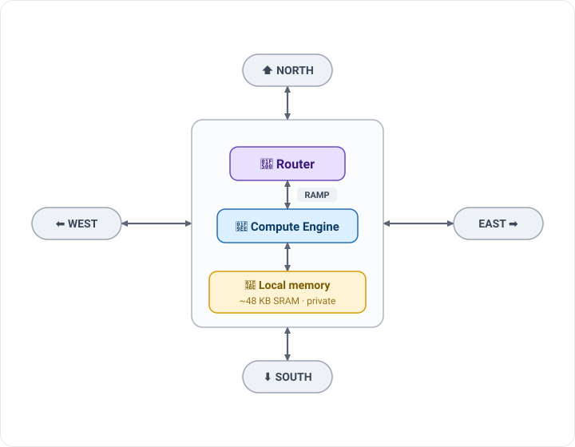

# 🎨 Cerebras SDK & CSL — Programming the Wafer


The **WSE-3** inside the Cerebras CS-3 is a nearly million-core wafer. Beyond AI, its ultra-high
bandwidth fabric suits HPC kernels — seismic imaging, CFD, Monte Carlo particle transport, molecular
dynamics (several Gordon Bell finalists). The **Cerebras SDK** lets you write your *own* wafer-scale
kernels in **CSL** (Cerebras Software Language), programming individual PEs and the routing between them.

> [!NOTE]
> **You write two pieces:** (1) **device code** in CSL that runs on the PEs, and (2) **host code** in
> Python that moves data on/off the wafer and launches functions. You'll develop and run everything on
> the **cycle-accurate fabric simulator** — no hardware needed.

---

## 🏗️ How the wafer is organized

The WSE is a **2D rectangular mesh of Processing Elements (PEs)** — hundreds of thousands of them
(≈900,000 on the WSE-3) on a single wafer. Each PE is a tiny, independent computer that talks **only to
its four neighbors**: North, East, South, West. **There is no shared memory anywhere on the wafer.**

```
┌────┬────┬────┐
│ PE │ PE │ PE │    every PE connects only to its
├────┼────┼────┤    N / E / S / W neighbors — data
│ PE │ PE │ PE │    reaches a far PE by hopping
├────┼────┼────┤    across the ones in between
│ PE │ PE │ PE │
└────┴────┴────┘
```

**Inside one PE** there are three parts:

<p align="center">
  
</p>

- **🧮 Compute Engine (CE)** — runs your CSL instructions.
- **💾 Local memory** — ~48 KB of SRAM holding this PE's data *and* code; no other PE can touch it.
- **🔀 Router** — the PE's only link to the outside world. It connects to the four neighbor routers,
  and to its *own* CE through the **`RAMP`** link.

PEs communicate by sending **wavelets** — 32-bit messages that hop to a neighbor in a **single clock
cycle**. Every wavelet is tagged with a **color** (one of 24 channels, IDs 0–23). That color does two
jobs at once: it **decides the wavelet's route** through the mesh **and** **which task consumes it** on
arrival.

> [!IMPORTANT]
> **Writing CSL mirrors this hardware in two steps:**
> 1. **Place** your program on a rectangle of PEs — `@set_rectangle`, `@set_tile_code`.
> 2. **Route** the colors — for each color on each PE, say where wavelets enter (`.rx`) and exit
>    (`.tx`), using `RAMP` (its own CE) and the compass `EAST / WEST / NORTH / SOUTH` (neighbors).
>
> The hands-on below is exactly **step 2**: the placement is done for you — **you wire the color.** 🎨

---

## 🧭 What you'll do


---

## 🛠️ Set up the SDK

On an ALCF Cerebras login/user node, copy the SDK and put `cslc` on your `PATH`:

```bash
cp -r /software/cerebras/cs_sdk-2.10 ~
export PATH=~/cs_sdk-2.10:$PATH
```

Verify it works:

```bash
cslc --help
```

> [!TIP]
> Add the `export PATH=...` line to your `~/.bashrc` so `cslc` and `cs_python` are always available.

> [!NOTE]
> Everything for the hands-on is **already in this repo** — no cloning needed.
> A **single-PE** GEMV uses **zero colors** (one processor, no network); **colors only appear the
> moment work crosses a PE boundary** — which is exactly what you'll wire below. 👇

---

## 🎨 Hands-on: GEMV on a 2×2 tile — wire the colors


📂 Files: **[`gemv-2x2/starter/`](./gemv-2x2/starter/)** — everything you need is here; you only edit `layout.csl`.
📖 Optional deep dive: **[`PE_PROGRAM_WALKTHROUGH.md`](./gemv-2x2/PE_PROGRAM_WALKTHROUGH.md)** — the device code, line by line.

### The problem

Compute `y = A·x + b` where `A` is `4×6`, spread across a **2×2 grid of PEs**. `A` splits into four
**quadrants** (one per PE), `x` is handed to the **top row**, and `b` is staged in the **left column**.
The final `y` lands in the **right column**, where the host reads it back.

```
        x[0:3]                    x[3:6]         <- host loads x into the TOP ROW only
           |                         |
     +-----v------+   ax_color   +-----v------+
 b ->| PE(0,0) NW | -- reduce -> | PE(1,0) NE | -> y[0:2]   (rows 0-1)
     |  y += A·x  |    EAST      |  + partial |
     +-----+------+              +-----+------+
  x_color  | SOUTH           x_color  | SOUTH
     +-----v------+   ax_color   +-----v------+
 b ->| PE(0,1) SW | -- reduce -> | PE(1,1) SE | -> y[2:4]   (rows 2-3)
     |  y += A·x  |    EAST      |  + partial |
     +------------+              +------------+

  x_color  = BROADCAST  x  down SOUTH   (top row feeds the bottom row)
  ax_color = REDUCE     y  toward EAST  (left column sums into the right column)
```

Two phases, and **two colors**:
- **`x_color` broadcasts `x` SOUTH**, so both PEs in a column can multiply their quadrant.
- **`ax_color` reduces the partial results EAST**, adding left + right into the final `y`.

> 🎬 Want to watch it happen? An [**interactive dataflow animation**](https://claude.ai/code/artifact/c62a8928-3b26-48c0-b930-36287f7d7bdf) steps through host → broadcast → multiply → reduce → readback with the real numbers.

### 🎨 The two colors

```csl
const ax_color: color = @get_color(0); // REDUCE:    partial y flows EAST
const x_color:  color = @get_color(1); // BROADCAST: x flows SOUTH
```

> [!IMPORTANT]
> Recall a **color** is a routing channel, and each PE gives it a **route**: `.rx` (where wavelets come
> in) and `.tx` (where they go out), using `RAMP` (its own core) and `EAST / WEST / NORTH / SOUTH`
> (neighbors). Here the two colors have **opposite jobs** — one fans data *out* (broadcast), the other
> funnels data *in* (reduce).

### ✅ Your task — wire the 8 routes

**Everything is written** — `pe_program.csl` (the compute), `run.py` (the host), the 2×2 placement —
**except the color routes.** Open [`gemv-2x2/starter/layout.csl`](./gemv-2x2/starter/layout.csl); each of
the **8** `@set_color_config` calls has an `EXERCISE` comment describing that PE's role. Fill every
`.rx`/`.tx` from `RAMP, EAST, WEST, NORTH, SOUTH`:

| PE | color | role | `.rx` | `.tx` |
|----|-------|------|:---:|:---:|
| `(0,0)` NW | `ax_color` | send partial `y` east | ❓ | ❓ |
| `(0,0)` NW | `x_color`  | originate `x` (self **+** south) | ❓ | ❓ |
| `(1,0)` NE | `ax_color` | receive partial from west | ❓ | ❓ |
| `(1,0)` NE | `x_color`  | originate `x` (self **+** south) | ❓ | ❓ |
| `(0,1)` SW | `ax_color` | send partial `y` east | ❓ | ❓ |
| `(0,1)` SW | `x_color`  | receive `x` from north | ❓ | ❓ |
| `(1,1)` SE | `ax_color` | receive partial from west | ❓ | ❓ |
| `(1,1)` SE | `x_color`  | receive `x` from north | ❓ | ❓ |

> [!TIP]
> **The subtle one:** on the **top row**, `x_color` has **two `.tx` destinations** — `.{ RAMP, SOUTH }`.
> `RAMP` delivers `x` back into the PE's *own* core (so it computes its quadrant), and `SOUTH` forwards
> it to the PE below. Every other route has a single `.rx` and a single `.tx`.

### ▶️ Compile and run on the simulator

```bash
cd gemv-2x2/starter
bash commands_wse3.sh
```

This runs `cslc` (compile) then `cs_python run.py` (fabric simulation). Correct routing prints
**`SUCCESS!`**, and the computed result is `y = [17, 53, 89, 125]`.

### 🚦 What you'll see

| Signal | Meaning | Fix |
|---|---|---|
| ❌ won't compile | a `???` is still there | fill in all 8 routes |
| ⏳ hangs forever | a route doesn't line up | e.g. a top-row `x_color` missing `RAMP` → that PE never receives its own `x`, never finishes, and the reduce deadlocks. Recheck directions. |
| ✅ `SUCCESS!` | both colors route correctly | 🎉 you wired a broadcast **and** a reduce |

<details>
<summary>💡 Stuck? Reveal a hint (not the full answer)</summary>

You don't need the whole answer — every route is one of just **three patterns**:

- **Sender** — pushes data from its core onto a link: `.rx = .{RAMP}`, `.tx = .{ <direction> }`
- **Receiver** — pulls data off a link into its core: `.rx = .{ <direction> }`, `.tx = .{RAMP}`
- **Broadcast originator** (top-row `x_color` only) — does both at once: `.rx = .{RAMP}`, `.tx = .{RAMP, SOUTH}`

For each of the 8 routes, ask: *is this PE **sending** or **receiving** on this color, and which way does that color flow?* Remember **`ax_color` flows EAST** (left column → right) and **`x_color` flows SOUTH** (top row → bottom).
</details>

### 🧠 Takeaway

- **1 PE → 0 colors.** Cross a PE boundary → you need a color.
- This tile uses **2 colors with opposite jobs**: a **broadcast** (`x_color`, fanning out via
  `.{ RAMP, SOUTH }`) and a **reduce** (`ax_color`, `RAMP → EAST` / `WEST → RAMP`).
- **Scaling up:** Conway's Game of Life needs **8** colors. Same idea, more wires. 🧵

---

## 📚 More information

- [ALCF Cerebras CSL guide](https://github.com/argonne-lcf/user-guides/blob/main/docs/ai-testbed/cerebras/csl.md)
- [Cerebras SDK documentation](https://sdk.cerebras.net/)
- [CSL examples repository](https://github.com/Cerebras/csl-examples)

[⬅️ Back to Cerebras overview](../README.md)
